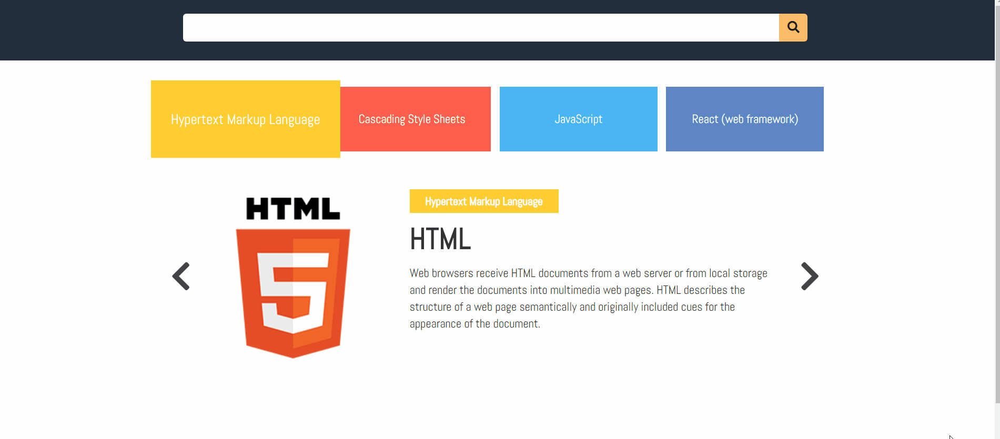
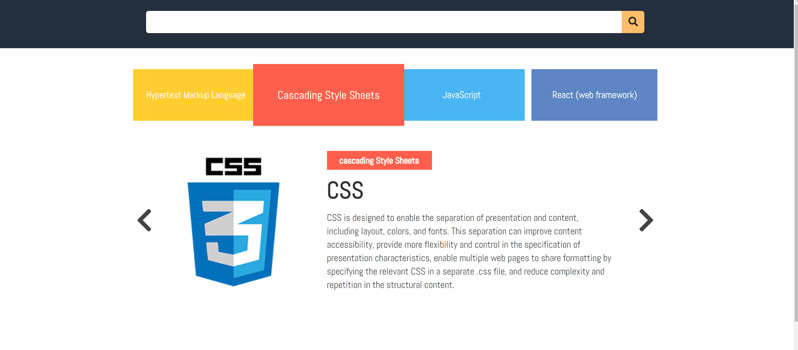

# Amazon

## 개요

- 기간 : 2020-02-10 ~ 2020-02-28
- 내용 : autoComplete, carousel

## 사용 도구 및 기술

- Front-end

  - HTML
  - CSS (transtion, transform)
  - Javascript (fetch, event deleagtion, prototype, promise)

- Back-end
  - Nodejs (Express)

## demo

[데모](https://elllin.github.io/demo/amazon-search/)

## 설계

express 서버를 간단히 구축한 뒤 mock data를 fetch 해서 화면을 렌더링 했습니다. 객체지향으로 처음 구현한 코드라 어떻게 나누고 어떻게 코드들을 연결 지어야 하는지를 많이 고민했습니다. main에서 코드들의 굵직한 동작들(큰 흐름)이 보이도록 했으며 객체들의 의존관계가 보이도록 했습니다. 또한 변할 수 있는 class name과 option들을 인자로 전달했으며 main에서 객체를 생성하는 함수를 각각 구현했고 복잡한 로직들은 각 클래스 내에 위치시켰습니다.

autoComplete에서는 재사용에 좀 더 초점을 두어 검색창 border focus기능이나 자동완성 기능등을 sub-routine으로 분리했습니다. 어떻게 나누면 다른 서비스에서도 사용할 수 있을까? 재사용 측면에서 계속 생각했고 검색창을 하나의 클래스로 분리하고 자동완성 기능을 따로 분리하여 자동완성 기능을 없애고 최근 검색어 기능을 추가할 수 있는 로직이 가능하도록 설계하자 생각했습니다.

## 프로젝트 1주차

1. OOP WITH ES Classes

   - OOP 핵심 개념

     - 캡슐화(Encapsulation)
     - 상속(Inheritance)
     - 다형성(polymorphism)
     - 추상화(abstraction)

   - 좋은 OOP
     - 역할과 책임
     - 높은 응집도(high cohesion), 낮은 결합도(loose coupling)

2. JavaScript에서 객체나누기는 어떻게 해야할까?

   - 보통 화면에 보이는 영역을 구분한 뒤에, 각각을 하나의 객체로 나누는 것이 좋다.

3. DOM제어

   - node 탐색
   - node 구조 변경

4. EVENT 종류 및 등록

5. ANIMATION

### [1주차 미션] 아마존 - 네비게이션UI

1. 아마존 네비게이션 UI 만들기
2. 아마존 네비게이션 UI ANIMATION

### 코드리뷰 받은 부분

1. 잘된 점

   - 메서드들 이름은 구체적으로 잘 표현
   - carousel 객체를 carouselCardMenu에 주입해줘서 의존성을 관리한 점,
     객체간의 관계가 코드에서 간단하게 보여지는 점
   - 나눈 클래스의 역할과 동작방식이 괜찮음
   - 클래스내의 메서드 크기가 적당

2. 개선할 사항

   - 나눈 class의 Carousel의 역할과 CarouselSlider의 역할을 어떻게 정의한 것일까?
     함께 같이 있어도 될거 같다는 생각이 든다

     -> Carousel이 CarouselSlider와 CarouselCardMenu의 공통으로 사용하는 속성들로 묶어서 상위 개념의 class로 구현해보자 라는 생각으로 구현했지만 Carousel의 역활이 애매해졌다.

   - constant라는 이름은 별로 의미가 없어 보여서 수정이 필요
   - carousel도 뭘 지칭하는 건지 알 수 없다. 좀더 구체적인 네이밍 고민 필요
   - 반복적인 코드 캐시해서 사용
   - 객체 생성 시 객체리터럴 표현법을 활용

### 느낀점

class 나누는 것이 익숙치 않아 어려웠다. 크게 slider와 cardMenu 부분으로 나누려 했지만 slider class가 너무 무거워지는 것 같아 sliderBtn구현 부분을 다른 class로 분리했다. 클래스의 핵심 개념을 이해하는 것과 코드에 반영하는 것은 아직까지 못하고 있는 것 같다. 앞으로 class에 대한 이해가 좀 더 필요할 것 같다.

### 이미지

## 프로젝트 2주차

- 비동기프로그래밍
  - call stack, callback queue,  event loop
- fetch API
- Promise 패턴
- Ajax
- DOM-TEMPLATING

### [2주차 미션] 아마존 - 비동기통신

1. JSON만들기

- 카드UI 기획에 필요한 데이터를 JSON형태로 만들었다.

  2. fetch API 적용

- 로딩이 완료되는 시점에, fetch API 를 활용해서 요청/응답을 받는다.
- 응답결과로 화면에 업데이트 된다. template literal 문법을 활용
- 한번 가져온 데이터는 local storage에 cache해서 재사용. 즉,  한번 요청한 정보는 다시 요청하지 않음
- 함수의 역할을 고민하고, 가급적 작은 함수로 분리.

### 코드 개선사항

- class별로 파일 분리
- className등 속성들을 config파일로 분리
- event 콜백함수를 분리
- 클래스 생성시 객체 리터럴 활용

### 코드리뷰

1. class는 네이밍을 어떻게 해야 할까 하는 고민

- 보통 너무 구체적이지 않는 명사로 표현
    예 > 바리스타클래스, 점원클래스, 커피메이커클래스

  2. 잘된 점

- main소스 구성 잘됨
- 클래스 크기 적당하다
- bind 사용 동작에 대해서 설명하실 수 있어야한다
- 전체적으로 이름은 잘 지었다

  3. 개선할 사항

- this.selectorName의 이름은 문자열 같기 때문에 (하지만 객체임) this. selector등의 이름으로 수정하는게 더 좋을 것 같다
- util함수의 이름은 $보단 _$으로 =>
    \$가 jquery라이브러리로 생각하기 때문

### 느낀점

저번 주에는 Carousel의 기능이라는 작은 부분만을 구현했지만 이번 주는 fetch를 받고 template 작업도 해줘야 했기 때문에 나눈 class와 파일들을 어떻게 연결해야 할지 어려웠다. 다른 사람의 코드를 많이 보며 배워야겠다고 느꼈다.

## 프로젝트 3주차

- prototype
- Event Delegation

## [3주차 미션] 검색자동완성

- JSON형태의 mock 데이터를 만들어서 응답하도록 했다.
- 검색UI와 검색자동완성노출UI를 별개의 prototype패턴의 객체로 각각 구현
- Event 등록은 delegation방법 활용
- fetch API 활용

## 코드리뷰

1. 잘된 점

   - 전체적으로 모듈분리 관리가 잘 된 코드
   - 재사용을 위해 sub-routine으로 분리한점

2. 아쉬운 점

   - return 문 뒤에 복잡한 식을 두지 않고 변수에 담아서 변수를 return하자
   - cardMeun에서 Delegation으로 event를 등록하지 않은 것
   - [config파일] 객체 생성에 필요한 값을 분리한건 그렇게 좋지 않다.
     객체에 어떤 값이 필요 할 지 보이는 게 좋다.
     에러메시지나 어떤 상수값들이 많다면 분리해도 좋다.

   ## 느낀점

   이번에는 재사용을 생각하며 구현해봤는데 생각보다 너무 어려웠다. 지금까지 재사용을 생각하며 구현한 적이 없었는데 이번 미션을 통해서 너무 큰 깨달음을 얻은 것 같다.

   ## 이미지

   
